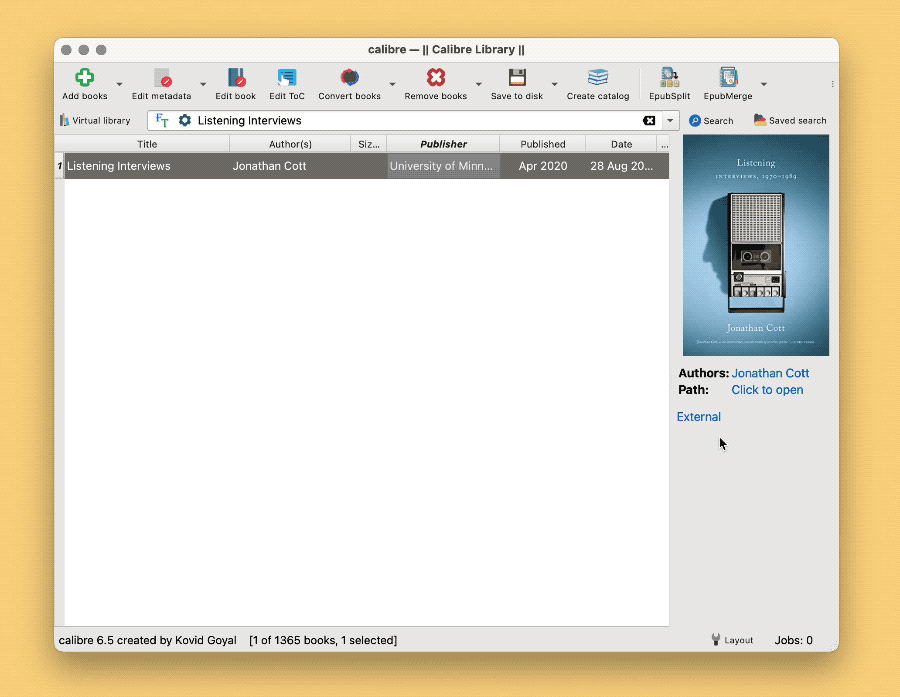

# Calibre Index

将任意文件夹中的书籍文件索引（Index）到 Calibre，统一管理、浏览和检索。

相关文章：

- [《巴别图书馆计划（一）：为什么，以及如何用 Calibre 统一管理书籍》](https://utgd.net/article/20253)（预计2023年8月中旬发布）
- [《巴别图书馆计划（二）：批量索引 DEVONthink 书籍到 Calibre》](https://utgd.net/article/20254)（预计2023年9月发布）
- [《巴别图书馆计划（三）：批量索引任意书籍到 Calibre》](https://utgd.net/article/20255)（预计2023年9月发布）

