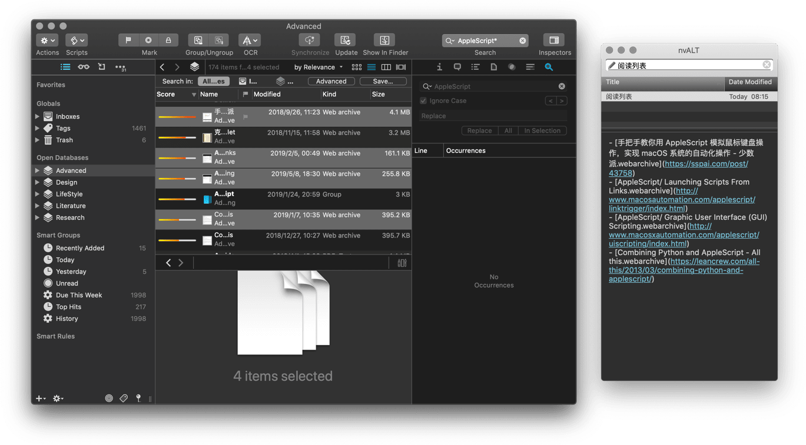

# Export Markdown Links for DEVONthink

选中 DEVONthink 中的文件，运行此脚本可生成 `[标题](link)` 样式的阅读列表到剪贴板。当然，需要文件本身就具有链接元数据，您可以在列表视图（List view）中轻松检查文件是否具有该项元数据。

出处：[《DEVONthink 脚本入门：以导出 Markdown 格式阅读清单为例 - UNTAG》](https://utgd.net/article/9608)

