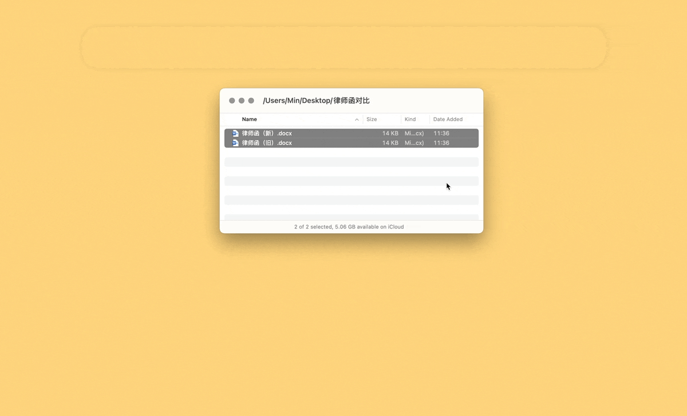

# Microsoft Word Compare

一键比对两个 Word 文档，绕开 Word 反人类的巨型界面和冗长操作。

只选中一个文档或多于两个文档时会弹出相应提醒，不会进行比较。

- 相关文章：[《一键对比两个 Word 文档（附自动化）》](https://utgd.net/article/20694)。
- [LaunchBar 版本](https://github.com/BlackwinMin/LaunchBar-gallery/tree/master/Microsoft%20Word%20Compare)
- [Shortcuts 版本](https://github.com/BlackwinMin/Shortcuts-Actions-gallery/tree/master/Microsoft%20Word%20Compare)

