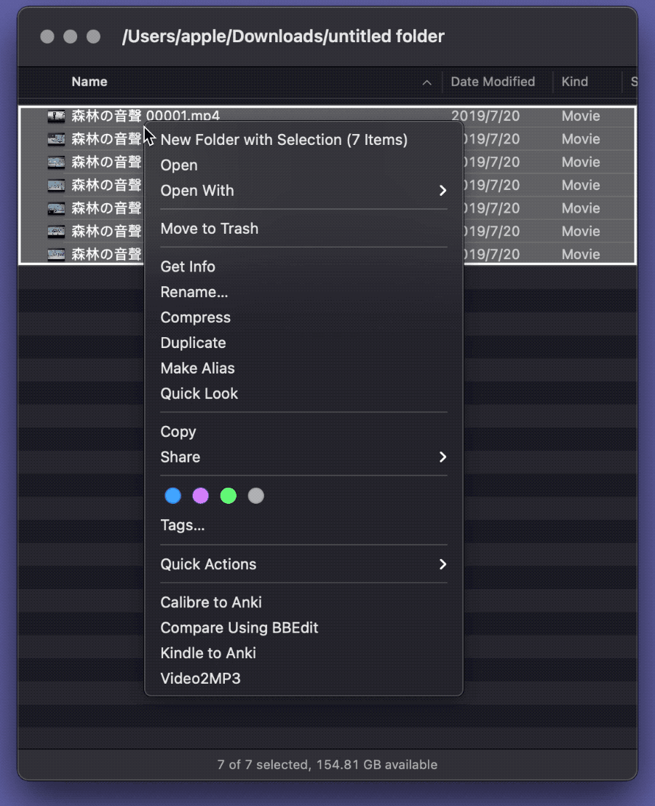

# Video or Audio to MP3 音频视频格式转换

一套基于 FFmpeg 的音频视频格式转换小工具，另有 [LaunchBar 版](https://github.com/BlackwinMin/LaunchBar-gallery/tree/master/Video%20or%20Audio%20to%20MP3)。

出处：[《音频视频格式批量转换终极工具：FFmpeg（附自动化）》](https://utgd.net/article/20132/)。

