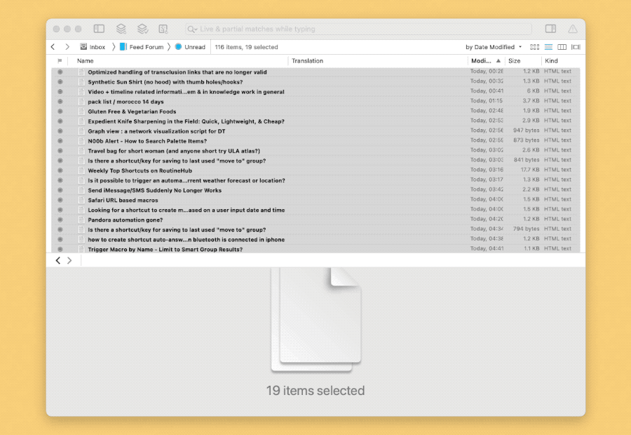

# DEVONthink RSS Translate

批量翻译文章标题，便于快速检视文章，判断那些值得继续阅读。

- 必需的配套 Shortcuts 动作 [DEVONthink 普通版下载](https://www.icloud.com/shortcuts/0b0ef5e8291d4996a92174e261c22dcd)
- 必需的配套 Shortcuts 动作 [DEVONthink Pro 版下载](https://www.icloud.com/shortcuts/4745bfcd8f0b464c8e1b1d542e113a11)
- 出处：[用 DEVONthink 批量翻译外文 RSS 标题 - #Untag](https://utgd.net/article/8406)

