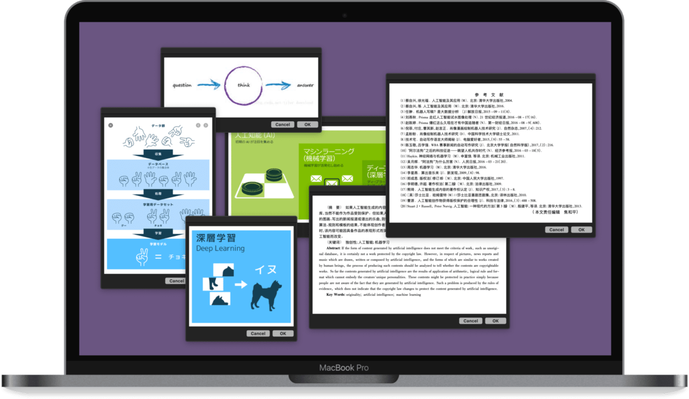

# image Snippet 截图贴图以及选图贴图

把重要信息随手一“贴”，再自然不过。且不说在墙上挂满笔记纸条的莱布尼兹，3M 化工发明的便利贴也畅销近半个世纪。在电子世界中，也不乏主打“贴”的工具，我自己就曾在 iOS 上制作过一个“贴”各类信息的 [Shortcut 动作](https://github.com/BlackwinMin/shortcuts-actions-gallery/tree/master/Pin%20Clipboard%20into%20Notification%20Center)。

到了 macOS 上，却鲜有趁手的“贴图”工具。常见的思路是借用剪贴板管理工具，但是这类工具往往依靠手动呼出，不能一直悬浮在旁，与其说是“贴”，更像是剪报，并不自然。偶有胜任者，无奈低声下气于系统授权，在 macOS 权限日益紧缩的大势下，随时可能失效。兜兜转转，还是往自动化工具的方向上探究。

本方案将主要围绕 Automator 的专有模块，实现将屏幕任意区域截取后“贴”起来的效果，而且“贴”的窗口可以随意移动、摆放，就像真正的便利贴一样。除了将截图贴住，我也提供了一个将现成图片贴起来的动作，拥有一致的显示效果。

出处：[《在 macOS 上随手贴图，Pin 住常用信息（Automator）》](https://utgd.net)（预计2023年6月下旬发布）。

