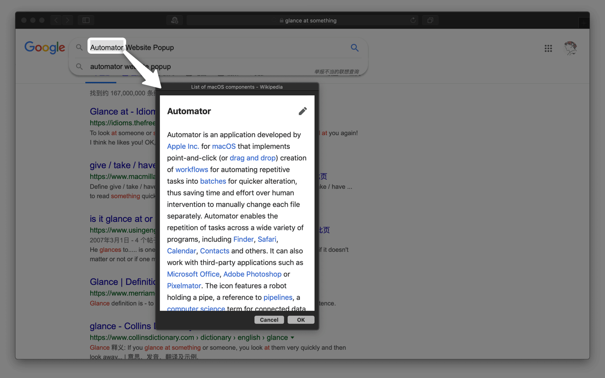

# websitePopup 浮窗搜索

Google、豆瓣等相关动作原用 Python 2 编写，当前 macOS 操作系统已经不再预装 Python 2，导致无法使用。当前仓库中的版本已经更新为 Python 3 版，请确保您的电脑已安装 Python 3。

选中任何文本，在右键菜单或自动化工具中运行相应动作，即可在迷你浮窗中查看搜索结果。

原文：[用 Automator 在迷你浮窗中即时搜索选中的内容 - #Untag](https://utgd.net/article/8913)。

